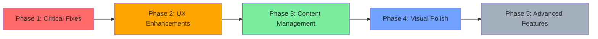

# Wedding Slideshow - Improvement & Feature Plan

## Overview

This document outlines recommended improvements and new features for the wedding slideshow application, organized by priority and category.

---

## Phase 1: Critical Fixes & Code Quality (High Priority)

### 1.1 Fix Environment Variable Handling

**File**: [`app/components/SlideShow.tsx:21`](app/components/SlideShow.tsx:21)

**Problem**: `process.env.NEXT_PUBLIC_API_BASE_URL` can be `undefined`, causing fetch URL to be `undefined/slides`.

**Solution**:

```typescript
const API_BASE = process.env.NEXT_PUBLIC_API_BASE_URL || "";
const res = await fetch(`${API_BASE}slides`);
```

Add `.env.local` template:

```env
NEXT_PUBLIC_API_BASE_URL=http://localhost:3001/api/
```

---

### 1.2 Fix SlideShow Auto-play Logic

**File**: [`app/components/SlideShow.tsx:42-56`](app/components/SlideShow.tsx:42-56)

**Problem**: Current logic creates a new timeout on every `index` change. While functionally correct, it lacks:

- Pause on hover/click
- Slide change counter (infinite loop without reset)
- Clean boundary handling when `slides.length` is 0

**Solution**:

```typescript
const schedule = useCallback(() => {
  if (slides.length === 0) return;
  const delay = MIN_DELAY + Math.floor(Math.random() * (MAX_DELAY - MIN_DELAY));
  timeoutRef.current = window.setTimeout(() => {
    setIndex((prev) => (prev + 1) % slides.length);
  }, delay);
}, [slides.length]);

// Reset timeout when index changes
useEffect(() => {
  schedule();
  return () => {
    if (timeoutRef.current) clearTimeout(timeoutRef.current);
  };
}, [schedule]);
```

---

### 1.3 Add TypeScript Strict Types

**File**: [`app/components/SlideShow.tsx:1`](app/components/SlideShow.tsx:1)

**Problem**: `@typescript-eslint/no-explicit-any` is disabled. The `data.data.map((s: any) => ...)` uses `any`.

**Solution**: Create a backend response type:

```typescript
type BackendSlide = {
  type: SlideType;
  images: string[];
  caption?: string;
};

type ApiResponse = {
  data: BackendSlide[];
};
```

---

## Phase 2: User Experience Enhancements (Medium Priority)

### 2.1 Slide Navigation Controls

**New component**: `app/components/NavigationControls.tsx`

**Features**:

- Previous / Next buttons
- Dot indicators showing current slide
- Click dot to jump to specific slide
- Pause on hover

```typescript
// Component props
interface NavigationControlsProps {
  totalSlides: number;
  currentIndex: number;
  isPlaying: boolean;
  onPrev: () => void;
  onNext: () => void;
  onGoTo: (index: number) => void;
  onPause: () => void;
  onPlay: () => void;
}
```

**UI Layout** (bottom center, semi-transparent):

```
[ ◀ ]  ● ○ ○ ○ ○  [ ▶ ]    [ ⏸ ]
```

---

### 2.2 Keyboard Navigation

**File**: [`app/components/SlideShow.tsx`](app/components/SlideShow.tsx)

**Add**:

```typescript
useEffect(() => {
  const handleKeyDown = (e: KeyboardEvent) => {
    switch (e.key) {
      case "ArrowLeft":
        setIndex((i) => (i - 1 + slides.length) % slides.length);
        break;
      case "ArrowRight":
        setIndex((i) => (i + 1) % slides.length);
        break;
      case " ":
        e.preventDefault();
        setIsPlaying((p) => !p);
        break;
      case "Escape":
        setIsFullscreen(false);
        break;
    }
  };
  window.addEventListener("keydown", handleKeyDown);
  return () => window.removeEventListener("keydown", handleKeyDown);
}, [slides.length]);
```

**Keys**:
| Key | Action |
|---|---|
| `←` | Previous slide |
| `→` | Next slide |
| `Space` | Pause / Resume |
| `F` | Toggle fullscreen |
| `Esc` | Exit fullscreen |

---

### 2.3 Progress Bar

**New component**: `app/components/ProgressBar.tsx`

**Features**:

- Thin bar at bottom showing time until next slide
- Animates from 0% to 100% during slide duration
- Color: gold `#c9a96e`
- Hides on hover (user is interacting)

```typescript
// Uses CSS animation with variable duration
<div className="h-1 bg-gray-200">
  <div
    className="h-full bg-gold animate-progress"
    style={{ animationDuration: `${delay}ms` }}
  />
</div>
```

---

### 2.4 Transition Effects Selector

**Current**: Only fade transition.

**Enhancement**: Add multiple transition options:
| Transition | Description |
|---|---|
| `fade` | Current opacity crossfade |
| `kenburns-fade` | Ken Burns + fade |
| `slide-left` | Horizontal slide |
| `zoom` | Zoom in/out |

**Implementation**: Add `TransitionType` enum and transition components.

---

## Phase 3: Content & Data Management (Medium Priority)

### 3.1 Local Image Support

**Problem**: Currently uses hardcoded Unsplash URLs.

**Solution**: Support both local and remote images.

**File structure for local assets**:

```
data/
└── wedding-album/
    ├── 01-banner.jpg
    ├── 02-couple.jpg
    ├── 03-ceremony.jpg
    └── slides-config.json
```

**Config format** (`slides-config.json`):

```json
{
  "slides": [
    {
      "type": "banner",
      "images": ["01-banner.jpg"],
      "caption": "Our Wedding Day"
    },
    {
      "type": "two",
      "images": ["02-couple.jpg", "03-ceremony.jpg"],
      "caption": "Together"
    }
  ]
}
```

**Implementation**: Add a build-time or runtime config loader.

---

### 3.2 Admin Configuration Panel

**New page**: `app/admin/page.tsx`

**Features**:

- Upload images via drag-and-drop
- Visual slide builder (select type, add images, type caption)
- Preview slideshow in real-time
- Export config as JSON
- Reorder slides via drag-and-drop

**UI Layout**:

```
┌─────────────────────────────────────────┐
│  [Upload Images]  [Preview]  [Export]   │
├─────────────────────────────────────────┤
│  Slide 1: [banner] [img1] [img2] ...   │
│  Slide 2: [two]    [img1] [img2] ...   │
│  Slide 3: [three]  [img1] [img2] ...   │
├─────────────────────────────────────────┤
│  [Add Slide]  [Delete]  [Move Up/Down]  │
└─────────────────────────────────────────┘
```

---

### 3.3 Background Music Support

**New component**: `app/components/AudioPlayer.tsx`

**Features**:

- Play/pause button (floating, top-right)
- Volume control slider
- Fade in/out on slide change
- Support MP3/WAV formats

```typescript
interface AudioPlayerProps {
  src: string;
  isPlaying: boolean;
  volume?: number;
}
```

**UI**: Minimal floating button that expands on hover.

---

## Phase 4: Visual & Polish (Low Priority)

### 4.1 Slide Transition Overlay

**New component**: `app/components/TransitionOverlay.tsx`

**Ideas**:

- Petal fall effect between slides
- Heart particles on transition
- Cinematic letterbox bars during transition

---

### 4.2 Customizable Theme

**Feature**: Allow users to customize:

- Color scheme (warm, cool, monochrome)
- Font pairings
- Animation speed
- Slide duration

**Implementation**: Theme context provider with preset themes.

---

### 4.3 Responsive Image Optimization

**Problem**: Images load at full resolution from Unsplash.

**Solution**:

- Use Next.js `Image` component for local images
- Add image lazy loading
- Implement responsive image sizes

```typescript
import Image from 'next/image';

<Image
  src={image}
  alt={caption}
  fill
  sizes="(max-width: 768px) 100vw, (max-width: 1200px) 50vw, 33vw"
  className="object-cover"
  loading="lazy"
/>
```

---

## Phase 5: Advanced Features (Nice-to-Have)

### 5.1 Slideshow Settings Modal

**New page**: `app/settings/page.tsx`

**Settings**:
| Category | Options |
|---|---|
| Timing | Slide duration (5-30s), Transition duration (0.5-2s) |
| Display | Fullscreen on start, Hide controls |
| Audio | Background music, Volume level |
| Theme | Color scheme, Font size |

---

### 5.2 Shareable Link / Embed

**Features**:

- Generate unique URL for each slideshow
- Embed iframe code for wedding website
- QR code for easy access

---

### 5.3 Photo Metadata Display

**Feature**: Show photo details on hover:

- Date taken
- Location
- Photographer credit

---

### 5.4 Loop Mode

**Feature**: Option to loop slideshow continuously or play once.

---

## Implementation Priority Summary



| Phase                 | Priority | Estimated Effort | Impact              |
| --------------------- | -------- | ---------------- | ------------------- |
| 1: Critical Fixes     | High     | 2-3 hours        | Reliability         |
| 2: UX Enhancements    | Medium   | 4-6 hours        | User Experience     |
| 3: Content Management | Medium   | 6-8 hours        | Content Flexibility |
| 4: Visual Polish      | Low      | 3-4 hours        | Aesthetics          |
| 5: Advanced Features  | Low      | 8-12 hours       | Wow Factor          |

---

## Recommended Implementation Order

1. **Fix env variable** (15 min)
2. **Fix auto-play logic** (30 min)
3. **Add keyboard navigation** (30 min)
4. **Add navigation controls** (1-2 hours)
5. **Add progress bar** (30 min)
6. **Local image support** (1-2 hours)
7. **Admin panel** (4-6 hours)
8. **Background music** (1-2 hours)
